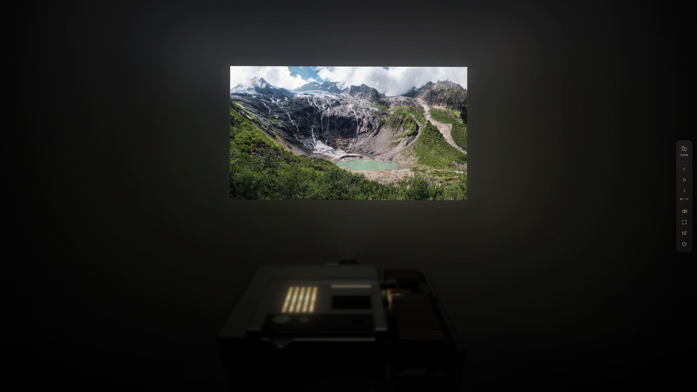

# Slide Ritual · 暗室虚拟幻灯机

[English](README.md) · **简体中文**

一个以 **徕卡 Leica P150** 幻灯机为灵感的网页观片室，在兼容的显示器与浏览器上支持 HDR。

选一个照片文件夹，坐进暗室。前景里的幻灯机轻轻虚焦，散热格窗透出暖黄色的光。风扇低鸣，片匣向前移动，照片在短暂的黑场之后落到墙上。暗室把幻灯放映的仪式感带回显示器，让每张照片都有被慢慢观看的时间和空间。



## 观看体验

- **参考 P150 重建的三维幻灯机。** 使用 Three.js，根据照片参考建立机壳、散热格窗、控制区、镜头、推片臂和直式片匣。观看视角位于机器后方，前景虚焦程度可以调整。
- **有节奏的开场。** 灯泡预热后，墙上先出现空片门的八边形白场，至少停留五秒，再装入第一张照片。
- **机械过片。** 旧片抽出归槽、片匣前进、新片推入。约 1.5 秒的过片过程结合横向移动、黑场、拖影和逐渐回稳的曝光，时序与观感依据参考视频建立。
- **随照片变化的光。** 墙面漫射带出照片中的颜色，轻微的光束与稀疏浮尘连接镜头和投影；散热格窗与进片口保留暖色漏光，并可调整泛光与机壳反射。
- **可分别调整的声音。** 机械录音伴随过片，合成风扇声构成持续的背景底噪。机械音量与风扇底噪可独立调整，也可一起静音。
- **安静的观片界面。** 横幅与竖幅照片完整显示，控制栏在停止操作 3.2 秒后自动隐藏，交互时重新出现。支持全屏、手机布局及系统的减少动态效果偏好；页面切到后台时暂停自动放映与声音。

机身几何、光学表现和机械运动均为根据参考建立的实时近似。墙面漫射、景深与空气散射采用轻量效果实现，未使用光线追踪。

## 开始使用

### 打开离线单文件

1. 下载项目，在浏览器中打开 **`darkroom.html`**。
2. 点击 **文件夹** 选择照片目录，或点击 **先看示例** 观看内置的三张照片。
3. 等待开场结束，导入的照片会自动放映；按 **F** 进入全屏。

`darkroom.html` 将三维引擎、样式、脚本、示例照片与声音内嵌在一个文件中，可以离线使用，无需安装依赖或启动服务器。目前界面语言为简体中文。

### 运行源码版

安装 Node.js 后，在项目目录执行：

```sh
npm start
```

随后打开 [http://127.0.0.1:8790](http://127.0.0.1:8790)。也可以执行 `node server.mjs`，或在 PowerShell 中运行 `./start.ps1`。内置静态服务器只监听本机，无需安装项目依赖。

## 操作与设置

| 操作 | 功能 |
| --- | --- |
| `←` / `→` | 上一张 / 下一张 |
| `空格` | 开始 / 暂停自动放映 |
| `P` | 幻灯机电源 |
| `M` | 声音开关 |
| `F` 或双击照片 | 切换全屏 / 沉浸观片 |
| `Esc` | 关闭设置并退出沉浸观片 |

设置面板可以调整画面大小、灯光亮度、镜头对焦、前景虚焦、投影质感和每张照片的停留时间。停留时间范围为 **2–30 秒**，默认 **4 秒**，默认开启循环放映；机械过片时间另计。

折叠设置提供墙面与空气散射、泛光、顶盖反射、机箱光源等调整。幻灯机可上下移动、在 **±12°** 范围内俯仰，照片的上下位置也可独立调整。显示设置支持自动选择 HDR、手动使用 SDR，以及在浮点 HDR 输出启用时调整 SDR 高光扩展。

## 装入自己的照片

选择文件夹会装入一个新片匣，包含子文件夹，忽略非照片文件，并按相对路径与文件名自然排序，例如 `2.jpg` 排在 `10.jpg` 前。重新选择文件夹会替换当前片匣。通过设置选择单独文件或将文件拖入页面，首次导入会替换示例照片，之后追加到已有片匣。

| 格式 | 处理方式 |
| --- | --- |
| JPEG、PNG、WebP、AVIF | 由浏览器解码，具体可用性取决于浏览器的图片解码支持 |
| Radiance `.hdr` / `.rgbe` | 使用内置 RGBE 解码器，保留浮点高光数值 |
| GIF、BMP 等其他浏览器可解码图片 | 支持基本图片载入，项目主要面向静态照片观看 |
| HEIC / HEIF、相机 RAW、EXR、TIFF | 导入前请转换为支持的格式 |

单张文件上限为 **64 MiB**；普通图片上限为 **1 亿像素**，Radiance 图片上限为 **16,777,216 像素**。浮点预览会按比例缩小至约 **300 万像素**、最长边不超过 **2560 像素**，同时缓存两张已解码照片。原始文件保持不变。

照片在浏览器本地处理，应用没有照片上传服务或分析追踪，内置观片体验不依赖外部网络资源。片匣与设置仅在当前页面会话中有效，刷新页面会重置。

## HDR 与显示兼容性

在 **自动** 模式下，暗室会检测浏览器的 `(dynamic-range: high)` 信号及 WebGPU 扩展输出能力。浮点 HDR 路径使用 **`rgba16float`** 画布、**Display P3** 色彩空间和 **extended tone mapping**。图像处理、亮度调整、对焦采样与高光扩展均在线性光域完成，最后进行输出编码。三维机身使用独立的 SDR 渲染表面。

Radiance 文件从 RGBE 直接解码为浮点值。普通图片尝试通过浏览器色彩管理进行浮点读取；如果照片带有 HDR 元数据，但读取未保留高光，则保留原始浏览器 `` 表面，让浏览器处理其支持的增益图或 PQ / HLG 内容。在自动模式下，这条原生 HDR 路径会关闭亮度和对焦滤镜，以保留原生呈现。

SDR 照片也可以在 HDR 输出中获得轻微的高光扩展：默认 **2 倍**，可调范围 **1–4 倍**，低于线性光阈值的中间调不受扩展影响。这是一种观片效果，无法恢复源文件中已经缺失的高光细节；倍率表示相对信号水平，并非显示器的实测尼特值。

| 可用渲染路径 | 显示方式 |
| --- | --- |
| WebGPU 扩展输出与 HDR 显示环境均可用 | 浮点 HDR 投影 |
| WebGPU 可用，当前显示环境未启用 HDR | SDR 投影 |
| WebGL2 回退 | SDR 投影，HDR 源映射为 SDR |
| 浏览器原生回退 | 原生图片显示；Radiance 使用 CPU 生成的 SDR 预览 |

实际 HDR 观感取决于显示器、系统 HDR 设置、浏览器、显卡与图片解码支持。仅检测到 HDR 元数据，不能证明高光已呈现在显示器上。上方 JPEG 截图用于展示界面，无法展示 HDR 亮度。三维渲染不可用时，照片仍可继续放映，机身模型会缺席。

## 开发

项目使用原生 HTML、CSS 与 JavaScript ES modules，Three.js 随项目本地提供。运行源码版不需要前端框架、安装包依赖或构建步骤，也可通过支持 ES modules 的静态托管服务运行。

| 文件 | 职责 |
| --- | --- |
| `index.html`、`style.css` | 暗室、控制界面与响应式布局 |
| `app.js` | 导入、片匣、放映、设置与键盘操作 |
| `scene.js` | Three.js 机身模型、机械运动与墙面漫射 |
| `transition.js` | 光学过片、机械时序、开场与画幅布局 |
| `hdr.js`、`renderer.js` | RGBE 解码、颜色计算、WebGPU / WebGL2 投影 |
| `atmosphere.js`、`machine-light.js` | 光束、浮尘与机身泛光 |
| `audio.js` | 机械过片与风扇声音 |
| `tools/build-standalone.mjs` | 将源码与素材生成为离线 HTML |

浏览器入口与模块保留在仓库根目录，运行素材位于 `assets/`，三维引擎及其许可证位于 `vendor/`，单元测试与测试素材位于 `tests/`，历史实现说明位于 `docs/`。`tools/` 保留四个工具，分别用于生成离线版、生成测试素材、准备示例照片和合成风扇声。

运行现有单元测试：

```sh
npm test
```

测试涵盖颜色转换、高光扩展、RGBE 解码与错误处理、半精度浮点转换、过片时序、机械顺序及光束几何。原开发 README 完整保留为[实现说明](docs/IMPLEMENTATION_NOTES.zh-CN.md)。其中的 `qa/`、`reference/` 及历史浏览器脚本路径指向本地开发档案，相关资料不包含在公开仓库中。已记录的 GPU 与回退检查属于实现证据，实体 HDR 观感仍需在 HDR 显示器上评估。

修改源码或素材后，在项目目录重新生成离线版：

```sh
node tools/build-standalone.mjs
```

可选素材工具需要 Python、Pillow 和 NumPy：`tools/prepare-assets.py` 下载示例照片并重新生成风扇声；`tools/prepare-fan.py` 只生成风扇声，并在 `qa/` 中写入已忽略的本地报告。执行 `node tools/create-fixtures.mjs` 可重新生成三个高光与失败处理的合成测试文件。普通观片、Node.js 单元测试和离线版生成均不需要 Python 或 Browser Harness。

## 致谢与许可

- **Three.js r160** 以 MIT 许可随项目提供，见 [vendor/LICENSE-three](vendor/LICENSE-three)。
- **示例照片** 来自 Unsplash，来源链接记录在[实现说明](docs/IMPLEMENTATION_NOTES.zh-CN.md#素材与复现)及 `tools/prepare-assets.py` 中。
- **过片声音** 截取自开发时提供的录音，此仓库仅提供用于播放的 `assets/advance.wav`；风扇声由 `tools/prepare-fan.py` 合成。
- **机身外观与机械运动** 参考了保留在本地开发档案中的 P150 照片与视频，原始参考媒体不包含在此仓库中。

目前尚未添加项目本身的许可证。随项目提供的 Three.js 许可证适用于该依赖；照片与参考媒体保留各自的权利归属。
